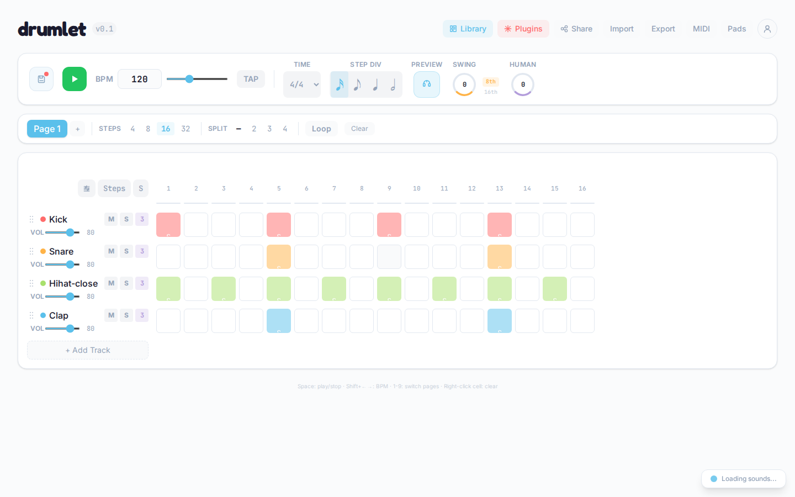

# drumlet

A browser-based rhythm education game and step sequencer. Build patterns, play them live for accuracy scoring, and share challenges with friends. Live at **[drumlet.app](https://drumlet.app)**.



## What it does

- **Step sequencer** with multi-page patterns (with pagination for long songs), time signature changes, swing, humanize, per-step velocities, and sub-cell stutter beats
- **Real drum machine samples** (TR-808, LM-2, CR-8000 and more) via [smplr](https://github.com/danigb/smplr)
- **Notation view** powered by VexFlow alongside the grid
- **Play-along modes** for practice, scored challenges, and "Telephone" rhythm chains
- **Library + plugin runtime** so factory grooves, lessons, and (later) third-party content all share the same UI surface
- **Themes** — built-in Light and Dark Studio, plus a runtime theming schema so plugins can ship custom themes (see [`docs/theme-plugin.md`](docs/theme-plugin.md))
- **Dottl-compatible** — exports/imports the [dottl-spec](https://github.com/pepperhorn/dottl-spec) v5 format so patterns interoperate with other Dottl-ecosystem apps

## Quick start

```bash
npm install
npm run dev -- --host 0.0.0.0
npm run typecheck   # tsc --noEmit
npm run build
```

Then open http://localhost:5173 (or the port Vite picks).

## Stack

- React 19 + Vite 8 + Tailwind 4 + TypeScript (strict)
- [smplr](https://github.com/danigb/smplr) for drum samples, single shared `AudioContext`
- [VexFlow](https://www.vexflow.com/) for notation rendering
- Optional `apps.pepperhorn.com` (Directus 11) backend for OTP-based user accounts, the rip pipeline, and curated library content — the app runs fully without it

## Sharing & file formats

Drumlet has three ways to load a pattern, all client-side — no backend required:

- **`#s=...`** — Drumlet's compact internal share format, encoded straight into the URL hash. The "Share" button generates these.
- **`#dottl=...`** — base64url-encoded raw [dottl-spec](https://github.com/pepperhorn/dottl-spec) v5 JSON. Used by external tools (rippers, Directus flows, third-party apps) to deep-link any Dottl pattern into Drumlet.
- **`.drumlet`** files (Export) — dottl-spec v5 with `extensions.drumlet` for round-trippable UI state. **`.dottl`** files (app-neutral) are also accepted on import.

## Project layout

```
src/
  audio/         audio engine, transport, drum groups, velocity config
  components/    Grid, Cell, TrackRow, Transport, Library, PageTabs, etc.
  plugins/       plugin runtime + built-in library/mode plugins
  state/         SequencerContext, reducer, presets, share codec, auth
  themes/        DrumletTheme schema + built-in Light / Dark Studio themes
```

See [`CLAUDE.md`](CLAUDE.md) for project conventions, [`DESIGN.md`](DESIGN.md) for the design system, [`ARCHITECTURE.md`](ARCHITECTURE.md) for the high-level architecture, and [`TS-MIGRATION.md`](TS-MIGRATION.md) for the TypeScript migration history.

## License

[GNU AGPL v3](LICENSE). If you host a modified version of drumlet as a network service, you must offer the source of your changes to users of that service.

Proprietary plugins that talk to drumlet through its plugin runtime are a separate work and are not covered by the AGPL.
